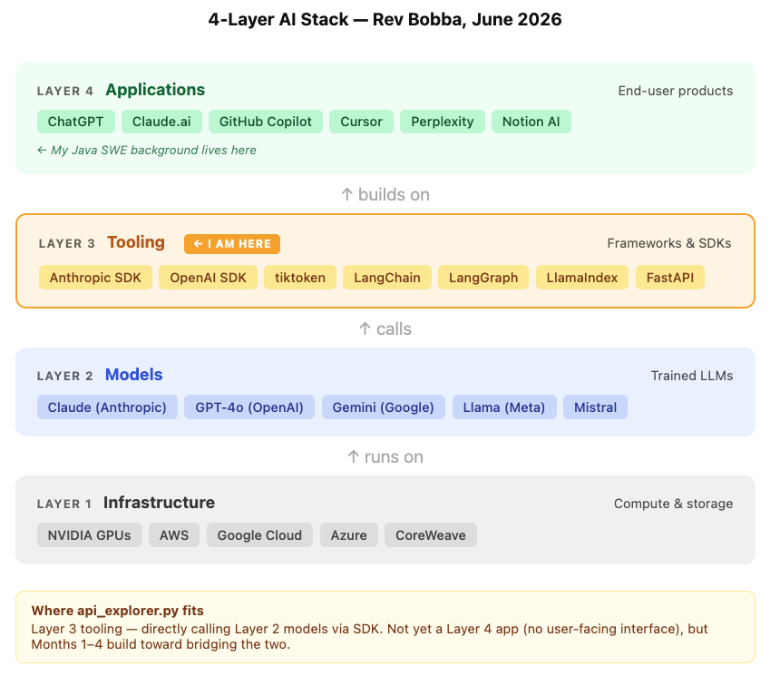

# Month 0: AI Landscape Explorer
**Part of Rev's AI Engineer Roadmap 2026**

> A Python script that calls Claude (haiku-4-5) and GPT-4o in parallel, logs responses, token counts, and cost per call. The foundation for 10 structured LLM comparison experiments.

---

## AI Stack Map



---

## What this does

- Calls Claude haiku-4-5 and GPT-4o with the same prompt **in parallel** (using asyncio)
- Logs every call to a structured JSON-lines file: model, response, tokens, cost, latency
- Includes exponential backoff retry logic for rate limit errors
- 10 named experiment functions — uncomment whichever you want to run in `main()`

---

## Setup

```bash
# 1. Clone the repo
git clone https://github.com/revanthbobba1/ai-roadmap-2026
cd ai-roadmap-2026/m0-landscape

# 2. Create and activate a virtual environment
python -m venv .venv
source .venv/bin/activate   # Mac/Linux

# 3. Install dependencies
pip install -r requirements.txt

# 4. Set up API keys
cp .env.example .env
# Edit .env and paste your Anthropic and OpenAI API keys

# 5. Run
python api_explorer.py
```

---

## What I learned

- **API costs are surprisingly cheap.** Running all 10 experiments cost roughly $1 total. The barrier to experimenting is basically zero.
- **LLMs don't pull from the internet at runtime.** Training is a one-time process on a static dataset. When a model answers a question, it's generating from learned patterns — not looking anything up. Hallucination happens because it's predicting plausible text, not retrieving facts.
- **Temperature controls conformity, not just creativity.** Lower temperature = the model picks the highest-probability token more strictly. Higher temperature = more randomness. At temp=0, both models returned identical output every run.
- **Rate limits and context limits are different things.** GPT-4o has a 128K context window, but my account's 30K TPM rate limit blocked requests long before hitting it. Hitting a rate limit doesn't mean the model can't handle more — it means the account tier can't.
- **Prompting techniques meaningfully shift model behavior.** CoT (chain-of-thought) and system prompts make models more structured, literal, or thorough without any retraining. Precision in prompt wording matters — vague constraints get softened, explicit ones get followed.
- **Response quality depends on context, not just output text.** The "better" response changes based on what the system can actually do, who the user is, and what they need. You can't judge LLM output in isolation.

---

## Cost

Running all 10 experiments costs approximately $1–2 total. Each individual call is typically $0.001–$0.01 depending on prompt length and model. Claude haiku-4-5 is consistently 2-3x cheaper than GPT-4o across all task types.

---

## Files

| File | Purpose |
|------|---------|
| `api_explorer.py` | Main script — one function per experiment |
| `llm_comparison.md` | Written analysis of all 10 experiments |
| `stack_map.png` | 4-layer AI stack diagram |
| `stack_map.html` | Source for the stack map diagram |
| `logs/` | JSON-lines experiment logs (gitignored) |
| `requirements.txt` | Python dependencies |
| `.env.example` | API key template |

---

## Full Analysis

See [llm_comparison.md](./llm_comparison.md) for the complete write-up of all 10 experiments — findings, observations, and model recommendations based on real data.

---

## Next: Month 1 — Prompt Engineering
_(link when built)_
